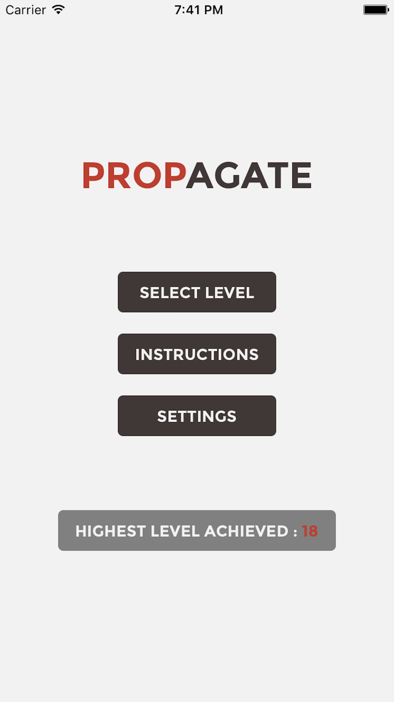
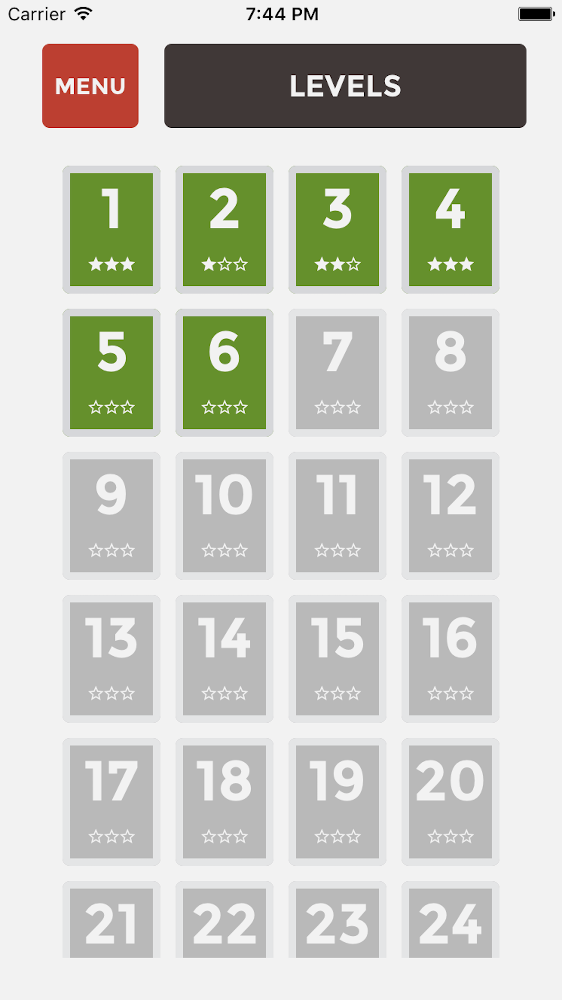
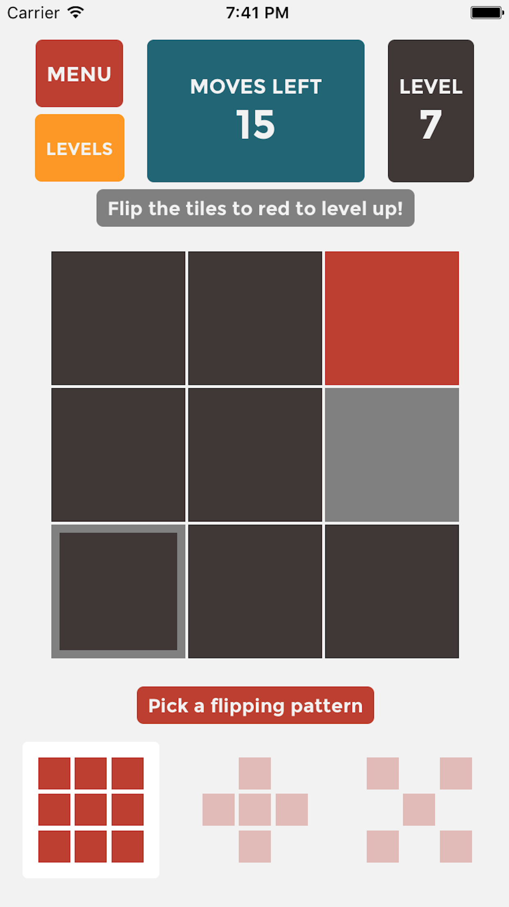
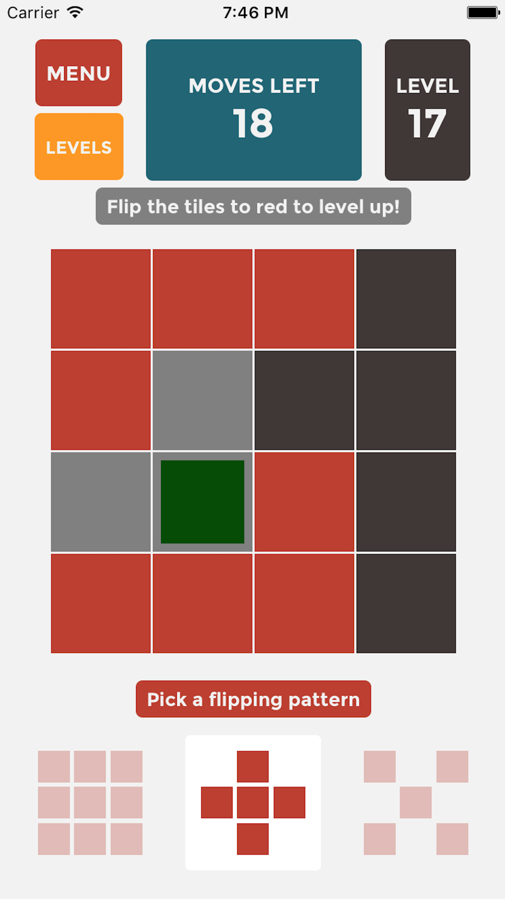
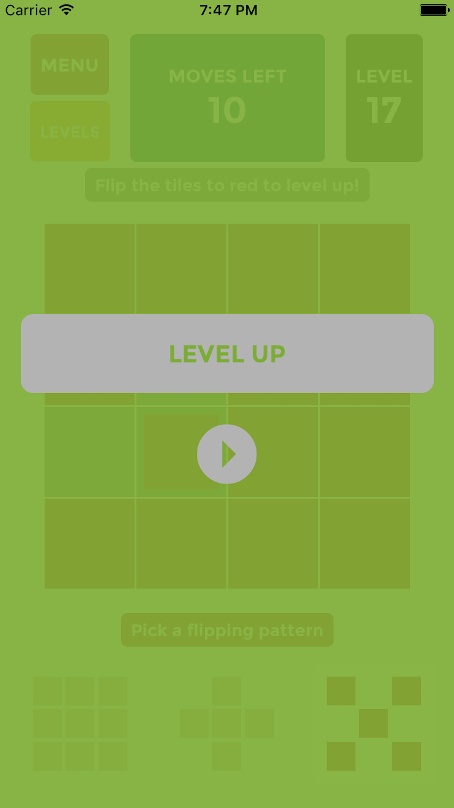

<h3 align="center">Propagate is a multi-level puzzle game built with react-native.</h1>

  Download Propagate in the Android and <a href="https://itunes.apple.com/us/app/propagate/id1252445122?mt=8">Apple</a> app stores!</>   
  
  
  
  
  

<h4>How to Play</h4>

  1. Choose "New Game" 
  2. Investigate your board 
  3. Choose between three different flipping configurations** 
  4. Flip all the tiles to red 
  5. Level up! 
  6. See how far you can get. Your score will increase as you go. 

  <strong>** flipping configurations are Square, Plus and Cross.</strong>
  - Clicking a tile in Square mode will flip 9 tiles in the shape of a square - 8 + the tile you are clicking
  - Clicking a tile in Plus mode will flip 5 tiles in the shape of a plus - 4 + the tile you are clicking
  - Clicking a tile in Cross mode will flip 5 tiles in the shape of a cross - 4 + the tile you are clicking

